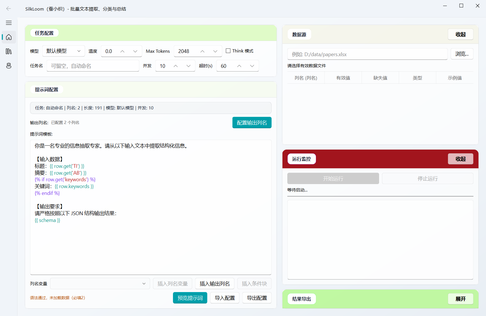
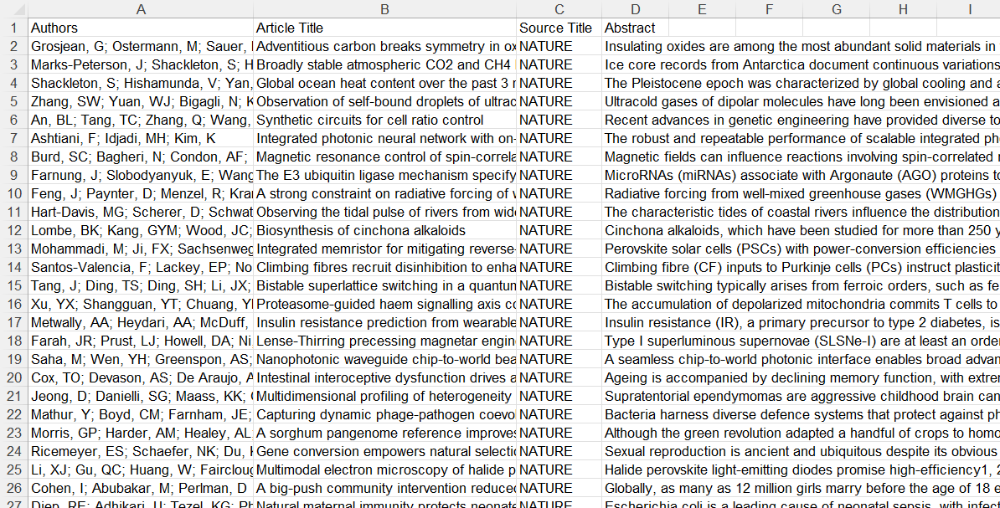
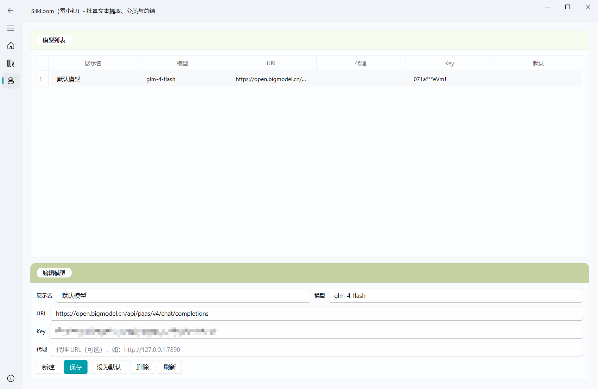
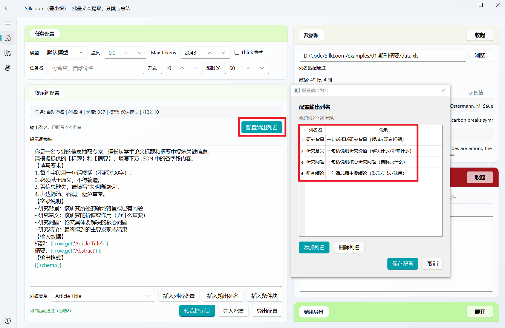
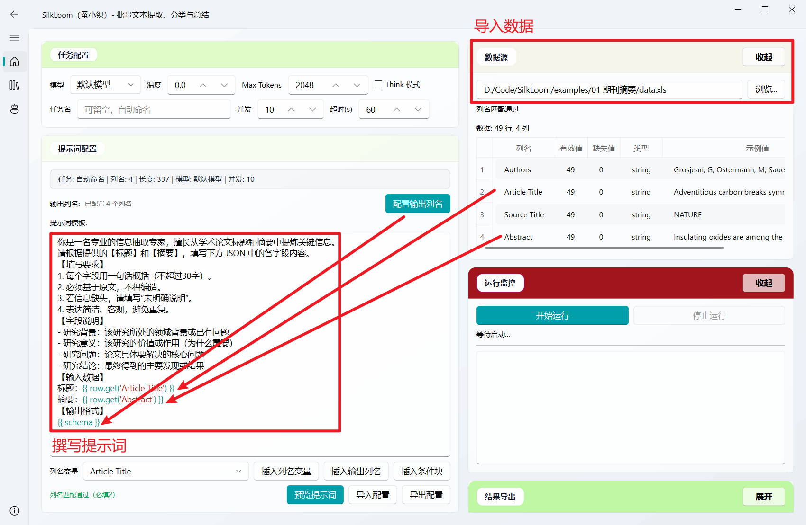

<p align="center">
  
</p>
<h1 align="center">SilkLoom（蚕小织）</h1>

<p align="center">
SilkLoom 是一个桌面工具：
</p>

<p align="center">
把你的 Excel/CSV/JSONL 文本，批量交给大模型处理，并导出结构化结果。
</p>


<p align="center">
  
  
  
</p>



## 你可以用它做什么

- 批量分析用户评论：情绪倾向、问题类型、核心诉求、一句话摘要
- 批量整理文献摘要：研究背景、研究问题、方法路线、关键结论
- 批量提取政策/新闻要点：主题、地区、时间、风险点、行动建议
- 批量归类客服工单：问题类别、优先级、处理建议、是否需要升级
- 批量处理调研文本：开放问答归纳、观点聚类、典型样本提取
- 批量做结构化抽取：把“长文本”变成可筛选、可统计、可导出的表格字段

一句话总结：只要你的数据是“按行存放的文本”，SilkLoom 就能帮你高效完成批量提取与整理。

---

## 设计初衷

确实，市面上有不少同类工具，从零写一个也不算特别难。我在研究中需要频繁利用LLM进行批量推理，我也在等待/寻找一个工具，但都不够简单。于是我写了一个。

但常遇到的不是“能不能跑起来”，而是：

- 能不能让非技术用户快速上手，而不是先学一堆环境配置
- 能不能稳定批量处理几千条文本，而不是跑几十条就卡住
- 能不能把提示词、输出字段、模型参数一起保存，方便实验记录
- 能不能把最简单常用的场景固定下来，而不是每次都“重写代码”

SilkLoom 想解决的正是这些“最后一公里”问题：
把大模型文本处理从“能用”变成“好用、稳用、可复用”，专心于任务本身。

## 1 分钟理解使用流程

你只需要做 4 件事：

1. 选择你的数据文件（Excel/CSV/JSONL）
2. 设置模型（填 API Key、接口地址、模型名）
3. 写处理要求（提示词）+ 定义输出字段
4. 点击开始，完成后导出结果

---

## 最简单安装方式（推荐）

直接下载并安装，不需要配置 Python：

- 最新版本：
  https://github.com/LeLiu-GeoAI/SilkLoom/releases/latest

常见安装包：

- Windows：`SilkLoom-v*-Windows-x86_64-Setup.exe`
- macOS（Apple Silicon）：`SilkLoom-v*-macOS-arm64.dmg`

---

## 第一次使用（照着做就行）

### 第一步：准备数据

支持格式：`.csv`、`.xlsx`、`.xls`、`.jsonl`

建议：

- 每一行是一条记录
- 列名尽量简单清晰，例如：`title`、`abstract`、`content`、`comment`

Excel 示例（位于examples\01 文献梳理\data.xls）：




### 第二步：添加模型

在“模型管理”中填写：

- 模型名称（随便起）
- API Key（从模型服务商获取）
- API 地址
- 模型 ID

示例（智谱）：

- API Key：`xxxxxxxxxxxx`（网上搜索“智谱AI开放平台API key获取”）
- API 地址：`https://open.bigmodel.cn/api/paas/v4/chat/completions`
- 模型 ID：`glm-4-flash`（智谱AI提供的免费模型）




### 第三步：定义你想要的输出

例如要分析文献，可以设置：



### 第四步：写提示模板并运行

```
你是一名专业的信息抽取专家，擅长从学术论文标题和摘要中提炼关键信息。
请根据提供的【标题】和【摘要】，填写下方 JSON 中的各字段内容。
【填写要求】
1. 每个字段用一句话概括（不超过30字）。
2. 必须基于原文，不得编造。
3. 若信息缺失，请填写“未明确说明”。
4. 表达简洁、客观，避免重复。
【字段说明】
- 研究背景：该研究所处的领域背景或已有问题
- 研究意义：该研究的价值或作用（为什么重要）
- 研究问题：论文具体要解决的核心问题
- 研究结论：最终得到的主要发现或结果
【输入数据】
标题：{{ row.get('Article Title') }}
摘要：{{ row.get('Abstract') }}
【输出格式】
{{ schema }}
```

然后：

1. 点击“预览提示词”先检查
2. 点击“开始运行”
3. 结束后导出 CSV/Excel/JSONL



---

## 可直接运行的 examples（推荐先跑通）

提供 3 个现成的示例任务，包含完整的数据、配置和输出字段定义。无需手写提示词，直接导入即可运行。

### 1）一键下载示例数据包

点击下载完整的示例数据包（包含所有 3 个示例）：

**[📦 下载 examples-data.zip](https://raw.githubusercontent.com/LeLiu-GeoAI/SilkLoom/main/examples/examples.zip)**

包含内容：
- `01 文献梳理/`：学术论文摘要分析（提取背景、意义、问题、结论）
- `02 旅游文本/`：旅行评论结构化（提取目的地、行程、预算等）
- `03 新闻评论/`：新闻跟评分析（提取立场、情绪、议题等）

每个文件夹内都预配置了 `data.*` 和 `task_config.yml`。

### 2）在 SilkLoom 中运行示例（3 步）

1. 解压下载的 zip 包。
2. 在主界面选择示例数据文件（`data.xls` 或 `data.csv`），点击"导入配置"并选择对应的 `task_config.yml`。
3. 设置模型配置（API Key、模型 ID）后点击"开始运行"。

提示：`task_config.yml` 中的 `api_key` 默认值为 `xxxx`，使用前请替换为你的真实 API Key。

---

## 常见问题（小白版）

### 运行按钮点不了

通常是这三种原因：

- 还没选择数据文件
- 输出字段是空的
- 提示词中用了不存在的列名

### 结果不完整或缺字段

先检查：

- 任务是否已经跑完
- 模型是否返回了标准 JSON
- 输出字段名是否和你的定义一致

### API Key 会不会泄露

数据保存在本地。请不要把带真实 API Key 的配置文件分享。

---

## 给进阶用户（可选）

如果你需要从源码运行（开发者场景）：

```bash
pip install -r requirements.txt
python main.py
```

---

## 反馈与支持

- 问题反馈：
  https://github.com/LeLiu-GeoAI/SilkLoom/issues
- 邮件：liule@lreis.ac.cn

## 学术研究

如果你使用本工具辅助学术研究（文本处理、数据标注等），务必：
1. **随机选取样本进行人工校验** — 验证大模型的提取结果是否准确。
2. **学习提示方法** - 例如少样本提示，思维链提示等等。可参考 https://www.promptingguide.ai/zh 
3. **在论文中注明方法** — 清楚说明使用了大模型进行批量提取，并描述验证方法和准确率。
4. **保留完整记录** — 保存原始数据、提示词配置、模型输出和人工校验结果，便于实验管理。

如果该工具帮助到您，请按需引用：

```text
Liu, L., Pei, T., Fang, Z., Yan, X., Zheng, C., Wang, X., ... & Chen, J. (2025). Extracting individual trajectories from text by fusing large language models with diverse knowledge. International Journal of Applied Earth Observation and Geoinformation, 141, 104654. https://doi.org/10.1016/j.jag.2025.104654
```

## 许可证

GPLv3